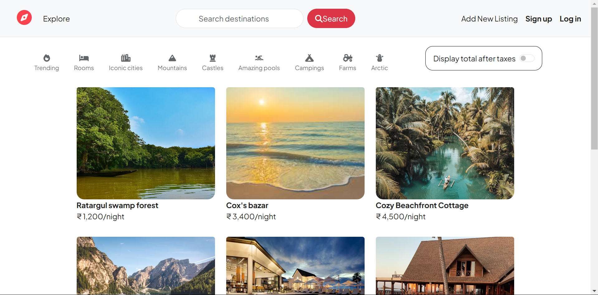
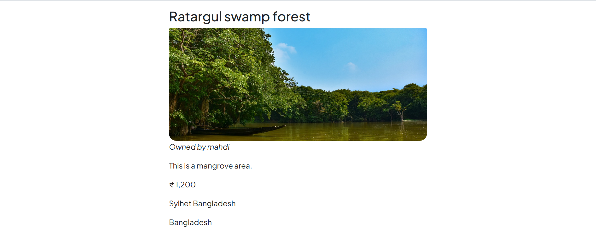
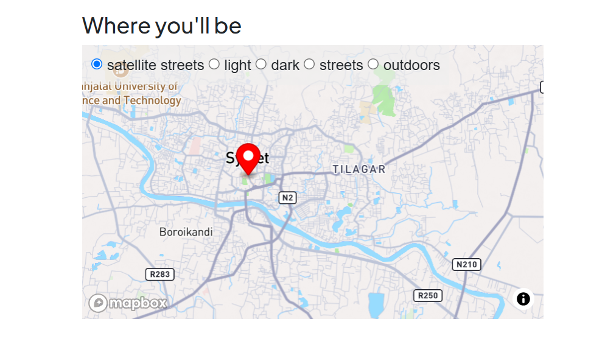
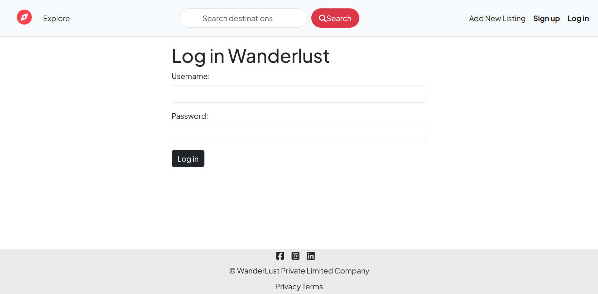
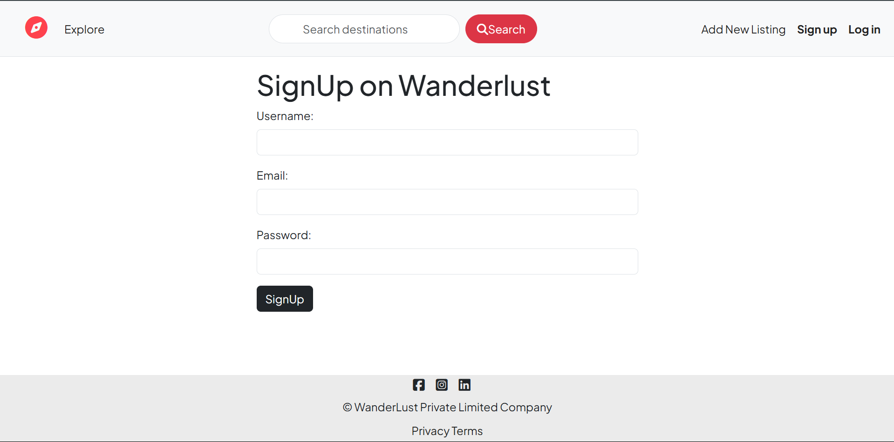
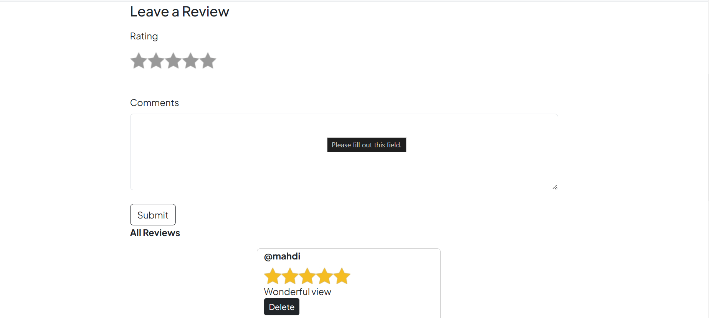
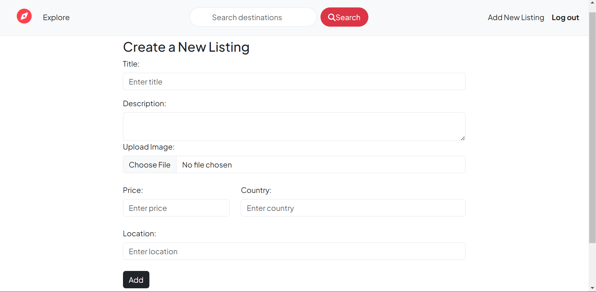

# 🌍 WanderLust Full Stack Travel Booking Platform

WanderLust is a full-stack travel accommodation web application where users can explore, create, edit, and review travel listings around the world.

---

## 🌐 Live Demo

🔗 https://wanderlust-fullstack-project-ig9j.onrender.com

---
## 🚀 Features

- 🔐 User Authentication & Authorization
- 🏠 Create, Edit & Delete Listings
- ⭐ Reviews & Ratings System
- 🗺️ Interactive Maps with Leaflet & OpenStreetMap
- 🔍 Search & Category Filters
- 📸 Image Upload Support
- 📱 Responsive UI Design
- ⚡ Flash Messages & Form Validation

---

## 🛠️ Tech Stack

### Frontend
- HTML
- CSS
- Bootstrap
- JavaScript
- EJS

### Backend
- Node.js
- Express.js

### Database
- MongoDB
- Mongoose

### Authentication
- Passport.js

### Maps & Geocoding
- Leaflet.js
- OpenStreetMap
- Nominatim API

---

## 📂 Project Structure

```bash
WanderLust/
│── controllers/
│── models/
│── routes/
│── views/
│── public/
│── init/
│── app.js
│── package.json
```

---

## ⚙️ Installation & Setup

### 1️⃣ Clone Repository

```bash
git clone https://github.com/Aditya1commits/WanderLust-FullStack.git
```

### 2️⃣ Move Into Project Folder

```bash
cd WanderLust-FullStack
```

### 3️⃣ Install Dependencies

```bash
npm install
```

### 4️⃣ Setup Environment Variables

Create a `.env` file:

```env
ATLASDB_URL=mongodb://127.0.0.1:27017/wanderlust
SECRET=your_secret_key
```

### 5️⃣ Start MongoDB

```bash
mongod
```

### 6️⃣ Initialize Database

```bash
node init/index.js
```

### 7️⃣ Run Project

```bash
nodemon app.js
```

---

## 🌐 Local URL

```bash
http://localhost:8080
```

---

## 📸 Screenshots

### Home Page


### Listing Page


### Map


### Login


### Signup


### Ratings


### Add New Listing


---

## 📌 Future Improvements

- Online Booking System
- Payment Gateway Integration
- Wishlist Feature
- Real-time Chat
- Admin Dashboard

---

## 👨‍💻 Author

### Aditya Chaudhary

- GitHub: https://github.com/Aditya1commits

---

## ⭐ Show Your Support

If you like this project, give it a ⭐ on GitHub!
